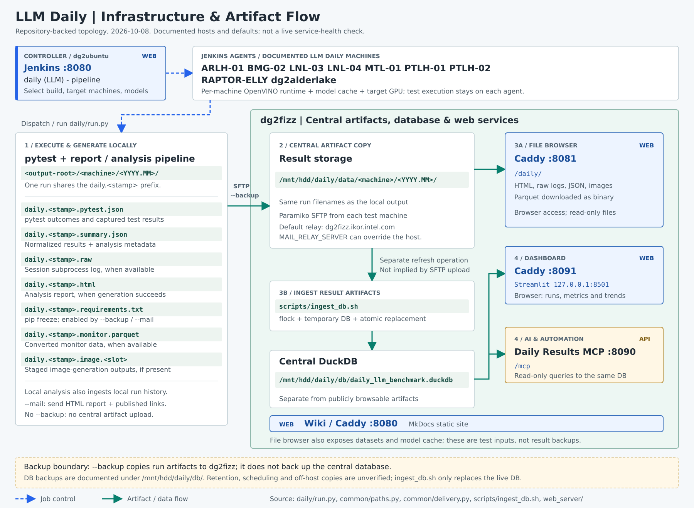

[Open the full-size diagram](assets/images/llm-daily-flow.svg).

## Web Service List (Team Server)
| Web | URL |
|---|---|
| Jenkins(LLM daily) | [http://dg2ubuntu.ikor.intel.com:8080](http://dg2ubuntu.ikor.intel.com:8080) |
| Daily result viewer | [http://dg2fizz.ikor.intel.com:8091](http://dg2fizz.ikor.intel.com:8091) |
| Daily results MCP | [http://dg2fizz.ikor.intel.com:8090/mcp](http://dg2fizz.ikor.intel.com:8090/mcp) |
| Model cache server(mirror) | [http://dg2fizz.ikor.intel.com:8081/model_cache_server](http://dg2fizz.ikor.intel.com:8081/model_cache_server) |
| Daily result files (logs & reports) | [http://dg2fizz.ikor.intel.com:8081/daily](http://dg2fizz.ikor.intel.com:8081/daily) |
| Benchmarking datasets(static models) | [http://dg2fizz.ikor.intel.com:8081/benchmarking_datasets](http://dg2fizz.ikor.intel.com:8081/benchmarking_datasets) |

## Github projects
| project | URL |
|---|---|
| openvino | [https://github.com/openvinotoolkit/openvino](https://github.com/openvinotoolkit/openvino) |
| genai | [https://github.com/openvinotoolkit/openvino.genai](https://github.com/openvinotoolkit/openvino.genai) |
| onednn | [https://github.com/uxlfoundation/oneDNN](https://github.com/uxlfoundation/oneDNN) |
| openvino-gpu-plugin-skills | [https://github.com/intel-sandbox/openvino-gpu-plugin-skills](https://github.com/intel-sandbox/openvino-gpu-plugin-skills) |
| run_daily | [https://github.com/sungeunk/run_daily](https://github.com/sungeunk/run_daily) |

##
- [https://gtax-ril-fm.intel.com/](https://gtax-ril-fm.intel.com/)
- [https://wiki.ith.intel.com/spaces/CVSDK/pages/3040655606/Submitting+GPU+Issues](https://wiki.ith.intel.com/spaces/CVSDK/pages/3040655606/Submitting+GPU+Issues)
- [GPU Driver CI Dashboard](https://gta.intel.com/web/#/reports/ci-dashboard?product=GFX%20driver&baseline=gfx-driver__master&mode=RESULTS&aggregations%5B%5D=cycle&aggregations%5B%5D=vertical&testCycles%5B%5D=CI&tagExceptOf%5B%5D=isolation&tagExceptOf%5B%5D=obsoleted&tagExceptOf%5B%5D=private&tagExceptOf%5B%5D=notAnIssue&tagExceptOf%5B%5D=iteration&unit=percentage&rerunFilter=Best&doNotIncludeSkippedInRerunCalculation=false&useOnlyUberBuilds=false&useOnlyWorkflowBuilds=true&showBuildsWithEmptyRows=false&showPassratesWithBlocks=false&splitMultiValue=false&showCustomBuildsOnly=false&showWfLinkPerBuild=false&page=1&pageSize=25&fullscreen=false&tagsSet=true&useBinaryColorScheme=false&binaryColorSchemeThreshold=100&latestBuilds=5&masterTasks=showAll&openPanels%5B%5D=settings)
- [https://neo-dashboard.app.intel.com/mainline](https://neo-dashboard.app.intel.com/mainline)
