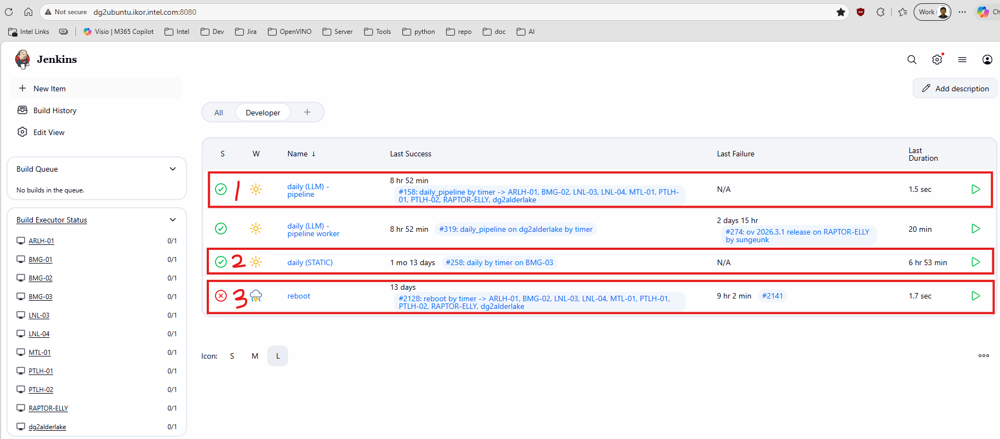

## Screenshot

## Builds
1. [daily (LLM) - pipeline](http://dg2ubuntu.ikor.intel.com:8080/job/daily%20(LLM)%20-%20pipeline)

    **Parameters**

    > Some parameters are intended for Jenkins debugging.

    - `DOWNLOAD_URL`: CPack URL. Check that the prebuilt package was built successfully. `This will be updated later so the PR number and commit ID can be entered more simply.`
    - `TARGET_MACHINE`: Select the machine that will run the test.
    - `PURPOSE`: Keyword used to identify the build. This is usually used for PR testing, so a value like `PR#12345 fix primitive issue` is recommended. It is used as the HTML report title and for filtering builds.
    - `MAIL_LIST`: Email recipients. Separate multiple addresses with `,`.
    - `SHORT_TEST`: *For Jenkins debugging.* Deprecated.
    - `TIMEOUT`: *For Jenkins debugging.* Cancels a test when it hangs. Default: 1800 seconds.
    - `MODEL_CACHE`: *For Jenkins debugging.* Selects a specific weekly model cache by name, such as `WW24_llm-optimum_2026.3.0-22130` or `WW20_llm-optimum_2026.2.0-21894-RC1`. This only works when the model exists on the target machine.
    - `RUN_DAILY_ROOT_TEMP`: *For Jenkins debugging.* Uses a `run_daily` repository from a specific location.
    - `MODEL_FILTER`: Selects the models to test.

2. [daily (STATIC)](http://dg2ubuntu.ikor.intel.com:8080/job/daily%20(STATIC))

    `Most static models are failing on BMG machines because the reference data has not been updated.`

3. [reboot](http://dg2ubuntu.ikor.intel.com:8080/job/reboot)

## Machines
| machine | platform | target device | support builds | note |
|---|---|---|---|---|
| ARLH-01 | ARLH (140T) | GPU | `daily (LLM) - pipeline` |  |
| BMG-01 |  | GPU |  |  |
| BMG-02 | BMG (B580) | GPU.1 | `daily (LLM) - pipeline` |  |
| BMG-03 |  | GPU | `daily (STATIC)` |  |
| LNL-03 | LNL (140V) | GPU |`daily (LLM) - pipeline`|  |
| LNL-04 | LNL (140V) | GPU |`daily (LLM) - pipeline`|  |
| MTL-01 | MTL | GPU |`daily (LLM) - pipeline`|  |
| PTLH-01 | PTLH (B390) | GPU |`daily (LLM) - pipeline`|  |
| PTLH-02 | PTLH (B390) | GPU |`daily (LLM) - pipeline`|  |
| RAPTOR-ELLY | BMG (B70) | GPU.1 |`daily (LLM) - pipeline`|  |
| dg2alderlake | DG2 (A770) | GPU.1 |`daily (LLM) - pipeline`|  |
